
<a href="README.md">Español</a> · <strong>English</strong>

  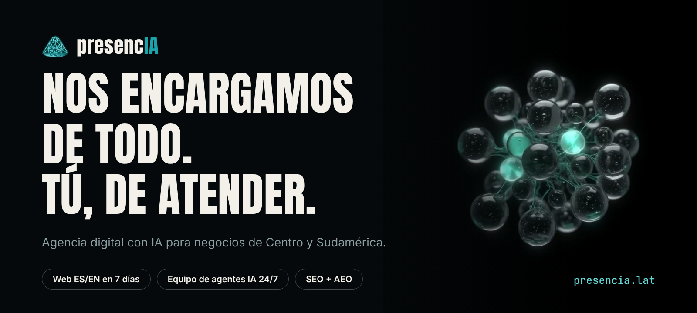

  
  
  
  

  <strong>presencIA</strong> is an AI-powered digital agency for businesses in Central and South America. 
  Your professional bilingual website live in 7 days, a team of five AI agents that answers your customers, 
  and visibility on Google and in AI assistants (ChatGPT, Perplexity, Claude) so people can find you.

  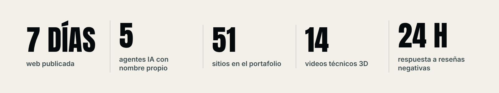

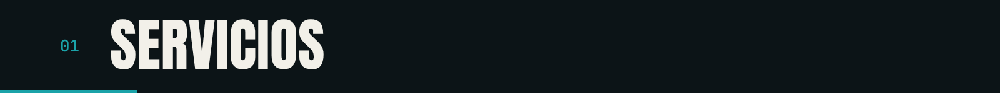

  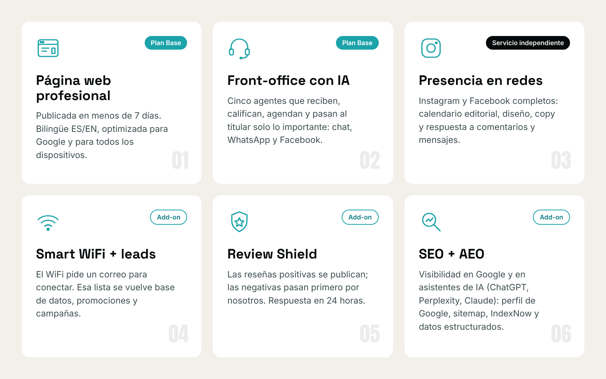

The **Base Plan** bundles the website and the AI front office. Every other service is a module you add on, with no lock-in.

<strong>Reference pricing</strong> (in quetzales, published at <a href="https://presencia.lat/sobre-nosotros">presencia.lat/sobre-nosotros</a>)

 

| Service | Reference |
|---|---|
| Base Plan (professional website + AI front office) | Q1,500 / month |
| Social media presence (standalone service) | Q1,500 / month |
| Vertical agent | Q3,000 / month |
| Add-ons: Smart WiFi, Review Shield, SEO + AEO | Q500 / month each |

Modular pricing, no lock-in. Values as of October 2026; the current quote is confirmed over WhatsApp.

  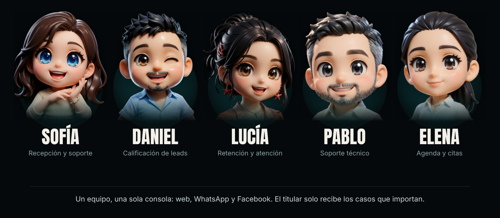

Not a chatbot: a **front-desk team** of five specialized agents that greet, qualify, book and hand the owner only the cases that matter, across chat, WhatsApp and Facebook.

| Agent | Role |
|---|---|
| **Sofía** | Reception and support |
| **Daniel** | Lead qualification |
| **Lucía** | Retention and customer care |
| **Pablo** | Technical support |
| **Elena** | Scheduling and appointments |

There is also the **Office Assistant**: an AI assistant trained on your documents and connected to Gmail, Calendar and Drive. It does not talk to your customers; it cuts internal manual work. Every agent is customizable in name, tone, knowledge base and limits.

  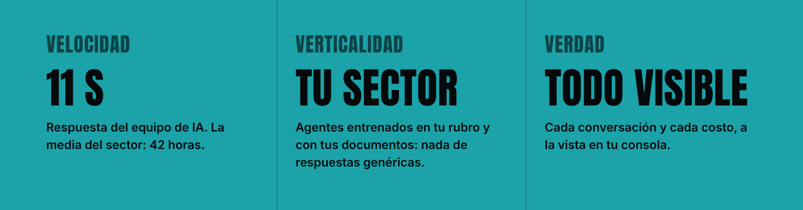

  <a href="https://presencia.lat/portafolio/">
    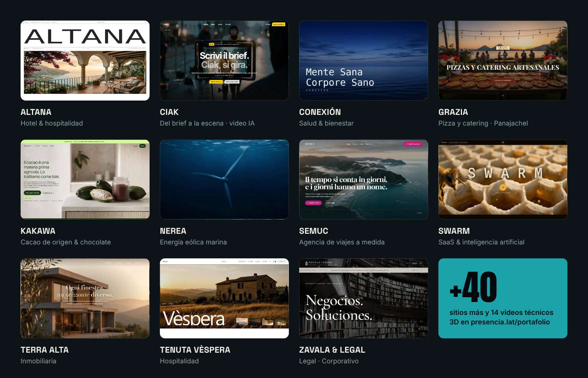
  </a>

Every site has its own visual language: no template is repeated. A few of the 51 published sites:
[Zavala & Legal](https://zavalaandlegal.com/) ·
[CIAK](https://agentemia.it/landing-page/ciak/) ·
[Nerea](https://agentemia.it/landing-page/nerea/) ·
[Altana](https://agentemia.it/landing-page/altana/) ·
[Tenuta Vèspera](https://agentemia.it/landing-page/vespera/) ·
[Lorenzo Bertani](https://agentemia.it/landing-page/bertani/) ·
[Ora Privata](https://agentemia.it/landing-page/ora-privata/) ·
[Trama](https://agentemia.it/landing-page/trama/) —
[full portfolio](https://presencia.lat/portafolio/).

We also produce **technical 3D videos** (14 pieces: roasters, water plants, solar and hydroelectric power, bridges and more) at [presencia.lat/videos](https://presencia.lat/videos/).

<table align="center">
  <tr>
    <td align="center">
      <a href="assets/video-spot.mp4">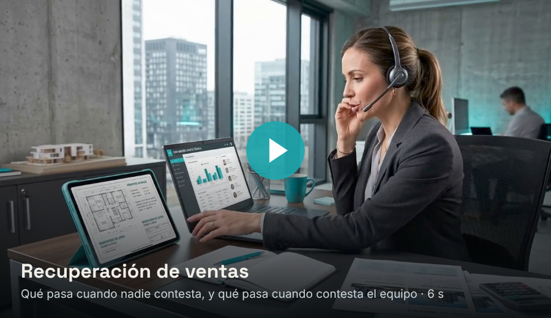</a>
    </td>
    <td align="center">
      <a href="assets/video-reel.mp4">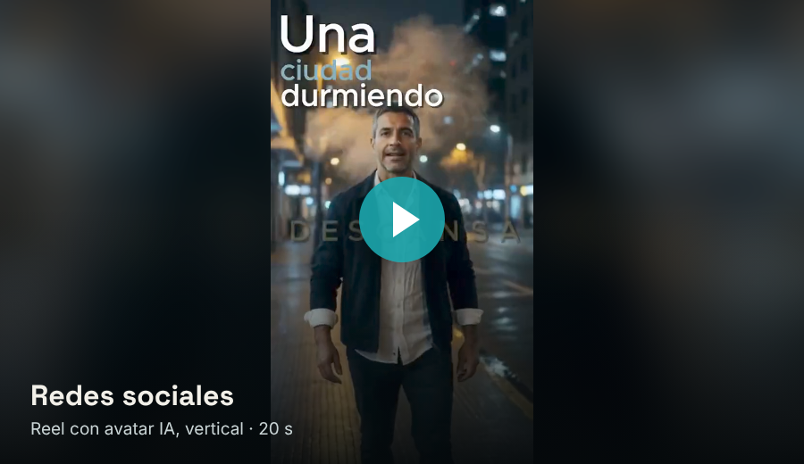</a>
    </td>
  </tr>
</table>

  <a href="https://www.instagram.com/presencia.lat/">
    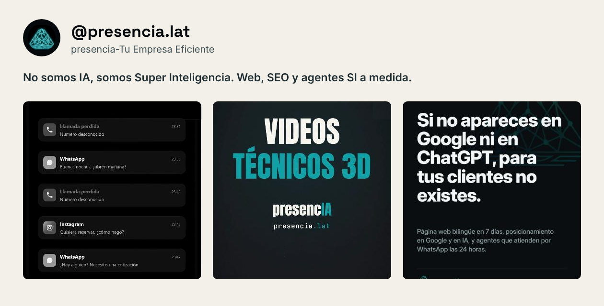
  </a>

  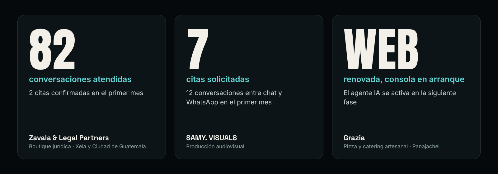

  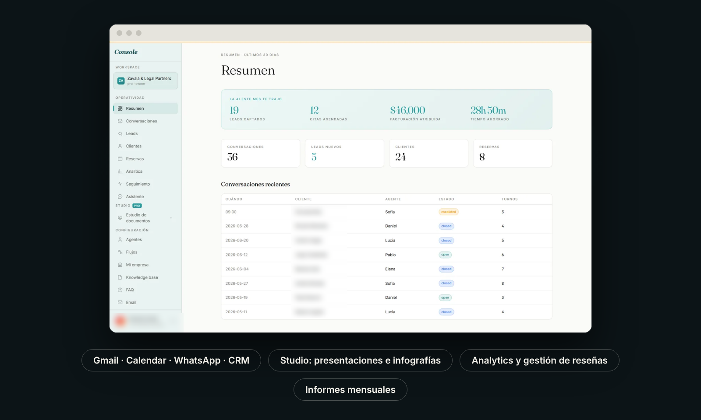

Every conversation (web, WhatsApp and Facebook) in a single console, with integrations to Gmail, Google Calendar, WhatsApp and CRM. It includes a studio for presentations and infographics, analytics, review management and monthly reports. When a lead does not convert, the console launches automatic follow-up campaigns.

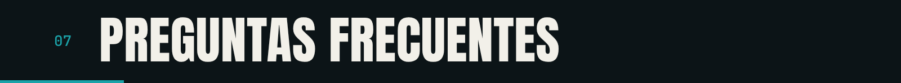

<strong>How long until my business shows up on Google?</strong>

 

Your listing appears on Google Maps in 3 to 7 days. Organic ranking takes 4 to 12 weeks.

<strong>What is AEO?</strong>

 

Answer Engine Optimization: getting your business to appear in the answers of AI assistants (ChatGPT, Perplexity, Claude). It relies on a verifiable digital presence (reviews, social profiles, mentions); if your business is new, we build that base.

<strong>Do I need technical skills?</strong>

 

No. We take care of everything; you take care of your customers.

<strong>What reports do I get?</strong>

 

Monthly reports covering visits, rankings, reviews and social reach.

<strong>How is presencIA different from other agencies?</strong>

 

We use AI in the process and in customer care, we specialize in Central and South America, and we deliver the website in 7 days.

<strong>Do the agents answer from my own documents?</strong>

 

Yes. The agents answer from a knowledge base you upload, trained on your sector.

  <a href="https://wa.me/50240725862">
    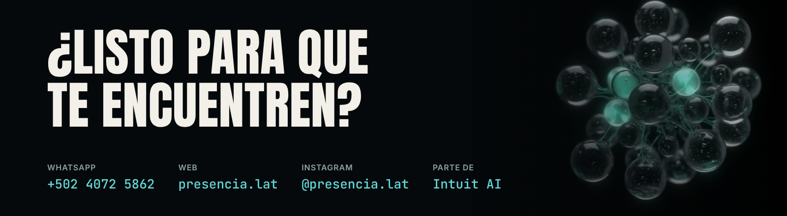
  </a>

Based in Panajachel, Sololá, Guatemala. We serve Central and South America: Guatemala City, Antigua Guatemala, Quetzaltenango and Sololá, among others.

---

## This repository

A public brand showcase: no code, no internal infrastructure, no secrets. Only positioning, product and portfolio, the same as [presencia.lat](https://presencia.lat). presencIA is part of **Intuit AI**. Sister brand: [agentemIA](https://github.com/MGEncrypted/agentemia) (Italy).

  presencIA · AI digital agency · Central and South America · an Intuit AI company

